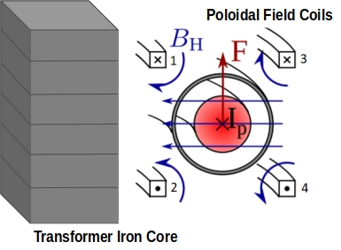
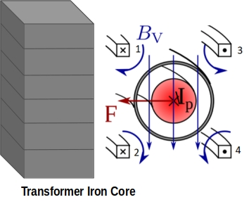

# Inductance
Similarly to [AdelaBp], the inductance of the stabilization windings is computed as:

$L = N^2 (\sum\limits_{i=1}^{m}L_i + \sum\limits_{i=1}^{m}\sum\limits_{i=1}^{m}a_{kl}M_{kl}), \quad a_{kl}\in\{-1,1\}$

<!--    -->

## Mutual Inductance Matrix

### 

$
\mathbb{M_{aa}} = \begin{pmatrix}
     L_1 & 0 & 0 & 0 & 0 & 0 \\ \\
    0 & L_2 & 0 & 0 & 0 & 0 \\ \\
    0 & 0 & L_3 & 0 & 0 & 0 \\ \\
    0 & 0 & 0 & L_4 & 0 & 0 \\ \\
    0 & 0 & 0 & 0 & \frac{1}{D_{N5}} & 0\\ \\
    0 & 0 & 0 & 0 & 0 & \frac{1}{D_{N6}}
   \end{pmatrix}
$

Methodology: 
- Self-inductance of one filament:  $L_i = \mu_0 r\left(ln(\frac{8r}{a})-2+\frac{Y}{4}\right)$
- Mutual inductance is computed by either analytical (elliptic integrals): $M_{i,j}=M(r_i,z_i, r_j, z_j) = \frac{2\mu_0\sqrt{r_ir_j}}{k}\left[\left(1-\frac{k^2}{2})K(k^2)-E(k^2)\right)\right]$, where $k^2 = \frac{4r_ir_j}{(r_i+r_j)^2+(z_1-z_2)^2}$ and $E$, $K$ are the complite eliptic integrals of the first and second kind 
 or by numerical method: $M_{ij}=\frac{\mu_0 r_ir_j\pi}{n}\sum\limits_{k=0}^{n-1}\frac{cos(\varphi_k)}{|(r_i - r_jcos(\varphi_k),r_jcos(\varphi_k,z_i-z_j))|}$

1. Mww; 
