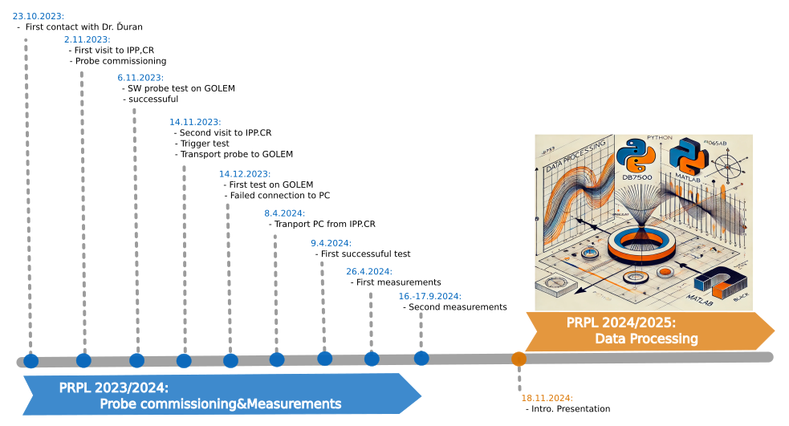
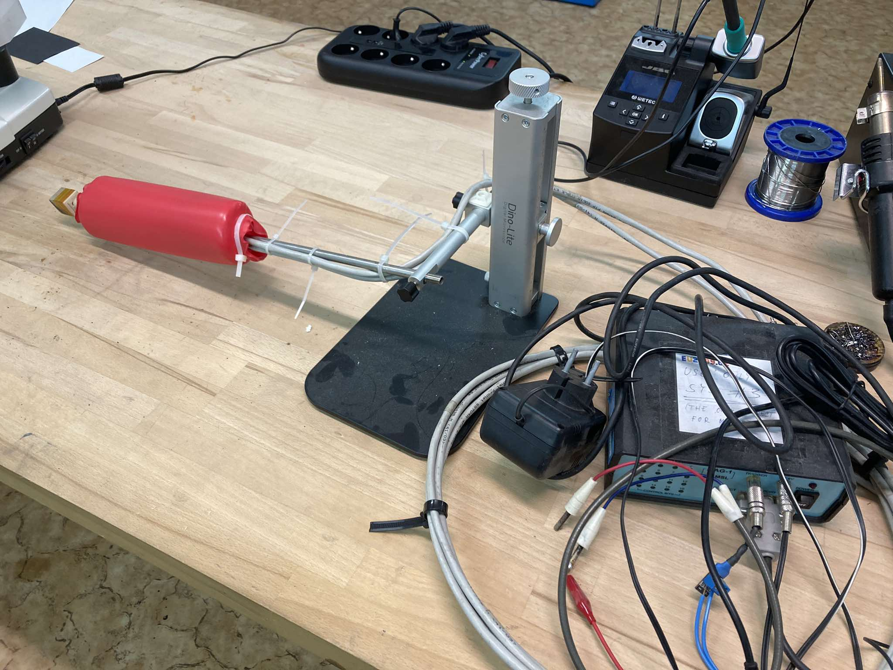
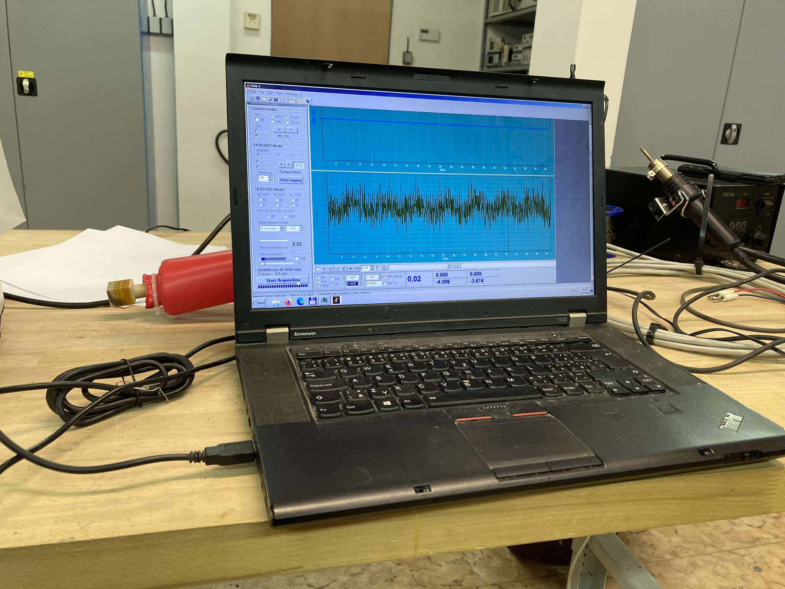
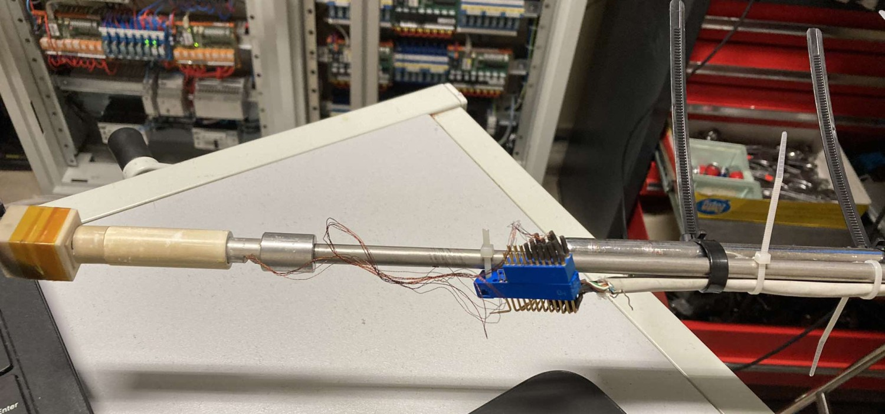
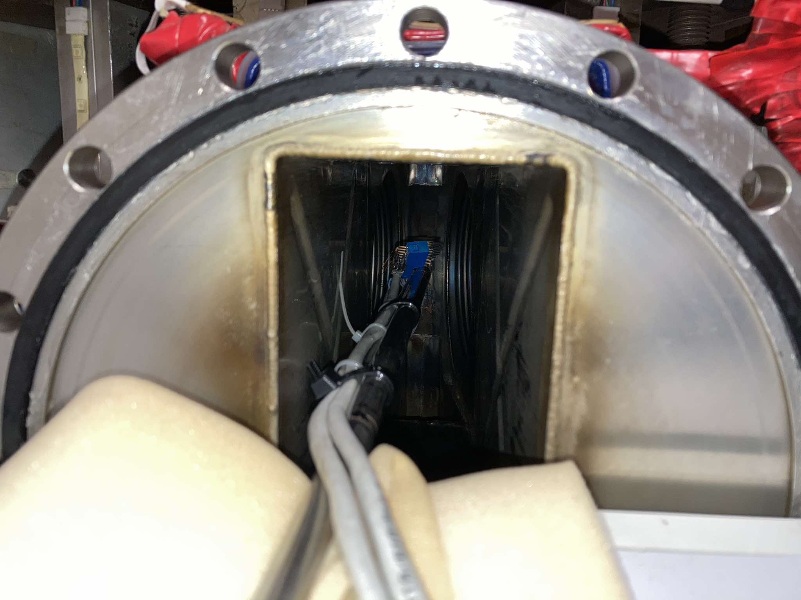

# Logbook

V následujícím jsou shrnuty všemožné postřehy, reporty a obecně vývoj celého tohoto projektu PRPL.

   
  <em></em>

### 23.10.2023

Komunikace s Dr. Ivanem Ďuranem a Dr. Tomášem Markovičem ([email](emails/Re_Měření_magnetických_polí_na_tokamaku_GOLEM.eml)).  
To podstatné/nejzajímavější shrnuto v 

### 2.11.2023 – První návštěva ÚFP

S panem Dr. Ďuranem jsme se pokusili zprovoznit sondu.  
Zpočátku byl problém s nějakým špatným kontaktem, kdy sonda vůbec neměřila, ale poté to nějakým zázrakem ("zakvedlání drátky" :D) začalo fungovat.  
Ještě zbývá vyzkoušet trigger, ale to až příště.

  <table>
    <tr>
      <td align="center">
         
        <em>Figure 1: Sestavení sondy na ÚFP</em>
      </td>
      <td align="center">
         
        <em>Figure 2: První testy</em>
      </td>
    </tr>
  </table>

### 6.11.2023

Ovládací software pro MSL sondy přetažen na Windows PC na GOLEMovi a zdá se, že ho lze i spustit.

### 14.11.2023 – Druhá návštěva ÚFP

Triggerování úspěšně vyzkoušeno => přenos sondy na GOLEM ("Hlavně pozor na drátky!")

### 14.12.2023

Sonda smontována, program na PC spuštěn, ale komunikace se sondou nefunguje.  
Vyzkoušeno i na jiném Windows notebooku, nicméně taktéž s verzí Windows 10.  
Oba dva počítače hlásí chybu, sice v trochu odlišné podobě, ale vždy jde o problém s portem a zřejmě i nějakou DLL knihovnou.

### 11.2.2024

- nejde-li to zatím prakticky, zkusíme to teoreticky  
- napsán skript pro výpočet magnetického pole `B_field.m` – možno vybrat mezi numerickou a analytickou metodou (eliptické integrály)  
- výpočet B numerickým způsobem otestován na jednoduchém příkladu, který má analytické řešení, viz `Test_B.m`; ve skriptu také porovnán numerický přístup s analytickým (využívající ell.int.) – na příkladu jedné cívky  
- napsán skript pro předpočítání a uložení hodnot magnetického pole vytvářeného jednotkovým proudem protékajícím cívkami stabilizace v daném bodě mřížky – uloženo jako `Bcoils_attempt01.mat`

#### TODO:

- [ ] Zpracovat výsledky porovnání metod + testování výpočtu dle `Test_B.m` (různé vzdálenosti, různá n, apod.)  
- [ ] Nutno zkontrolovat/upravit skript pro výpočet vzájemné indukčnosti, zejména ten numerický přístup bude možná špatně (prohozené souřadnice, apod.)

### 24.3.2024

Po přednášce TTJZ, kterou vedl Dr. Ďuran, došla řeč i na sondu.  
Po vylíčení problémů mi pan Dr. Ďuran s panem Doc. Entlerem nabídli zapůjčení staršího PC s Windows 7 na FJFI. (Tak proč toho nevyužít...)

### 8.4.2024

Převoz PC na FJFI (Díky Dominiku!)

### 9.4.2024

Nový počítač v kombinaci s redukcí (RS232 na HDMI) ATEN (+ nainstalování příslušného driveru) pomohlo!  
Sonda se připojila, měření teploty funguje, sonda reaguje na přiložení neodymového magnetku → Připraveno na měření

### 26.4.2024

- Měření s MSL sondou uvnitř komory tokamaku: http://golem.fjfi.cvut.cz/shots/0/Infrastructure/Homepage/psql/ShotsOfTheMission.php (za asistence Marka Tunkla a Lukáše Lobka)  
- Výsledky shrnuty [zde](experiments/2024_04_26/GOLEM_MSL_24_04_26.pdf)

### 16.9.2024 (46271–46280)

  <table>
    <tr>
      <td align="center">
         
        <em>Figure 3: Sestavení sondy tGOLEM</em>
      </td>
      <td align="center">
         
        <em>Figure 4:</em>
      </td>
    </tr>
  </table>

**r = -8.5 cm**  
BtScan: 46271–46275  
VertStab: 46276, 46280 (w/Saddle coil)  
RadStab: 46278, 46279 (w/Saddle coil)

### 17.9.2024 (46287–46340)

**r = -8.5 cm**  
InnerQuadr: 46287  
EtScan: 46288, 46290  
DummyDischarge: 46291 (Bt_400, Ucd_325), 46293 (Bt_800, Ucd_325)  
RadQuadr: 46294  
DummyDischarge+RadQuadr: 46295  

**r = 0.0 cm**  
BtScan: 46296–46300  
BtScan (opposite direction): 46307–46311  
Et: 46305  
dummyDischarge: 46306  
dummyDischarge (opposite direction): 46312–46314  
InnerQuadr: 46301, 46302 (different orientation)  
VertStab: 46315  
RadStab: 46304  
RadQuadr: 46303

**r = 8.5 cm**  
šum: 49317  
BtScan: 46331–46335  
DummyDischarge: 46336–46339  
DummyDischarge+RadQuad: 46340  
BtScan (opposite direction): 46321–46325  
DummyDischarge (opposite direction): 46326–46328  
Et: 46329 (Ucd_200), 46330 (Ucd_325)  
VertStab: 46316  
InnerQuadr: 46318  
RadStab: 46319  
RadQuadr: 46320

#### Inner Quadrupole

- Kepca z vertikální zapojena do vinutí Inner Quadrupole → request freq. generátoru na osciloskopu pro vertical stab  
- Sběr proudu na fluke loop Jendy Buryance (proudová stabilizace) – pro naše účely nastaveno na 10 mV/A  
- Na vertikální stabilizaci 5 kepec, na radiální × FastSpectrometry

**r = -8.5 cm**  

**r = 0.0 cm** – zkoušena i jiná orientace Bt pole + také s Ecd (to ale neměněno); během toho také navrácena zpátky vertikální (46315)

**r = 8.5 cm** – 46317 dost možná prohozena polarita u inner quadr. oproti předchozím – nesepnulo → data uložena pro offset (jak poznamenal Lukáš)

---

**Dipol nebo Kvadrupol? – Email z 25.2.2020**  
> Interpretoval bych to takto. Vinutí na GOLEMu je kvadrupol, neboť obsahuje 4 vodiče. Tyto jsou pak zapojeny tak, že vytvářejí dipólové magnetické pole.  
> *Dr. Stöckel*

---

### Zpracování

1. Inner Quadrupole  
2. Better identification of the model constants for vertical and radial stab.  
3. Vertical Stray Field from toroidal field coils  

**TODO:**  
Z porovnání výbojů z 16.9. (kdy jsme ještě neřešili kvadrupol) a výbojů z 17.9. by mělo být vidět, zda tam bylo přítomné nějaké pole, které tam být nemělo.

**TODO:**  
Instead of that “dynamic” B–S figure for one shot, take max. B at max current of many shots and compare.

---

### 7.3.2025

- Sonda spolu s počítačem navrácena na ÚFP

### 16.5.2025

- Finalizace: psaní reportu, upload na GitHub,...
