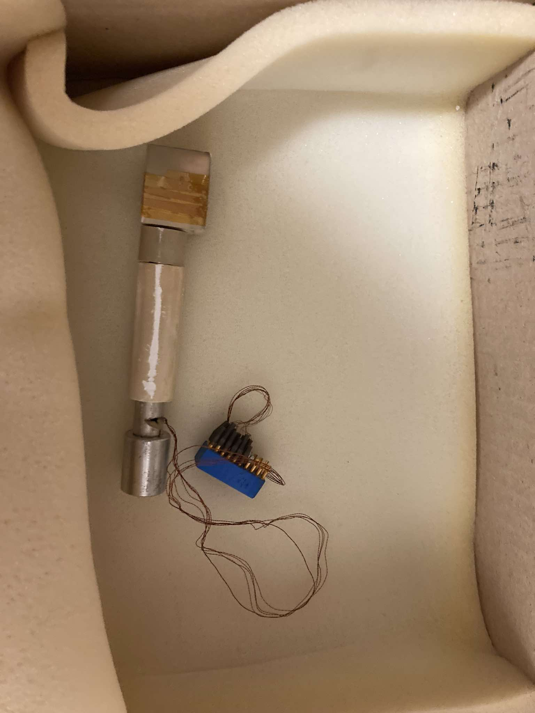
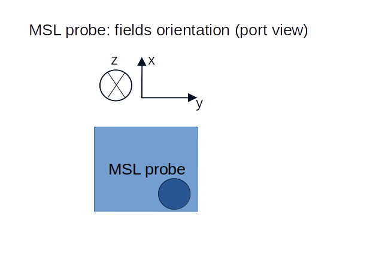

# MSL probe
- consists of 3 Hall sensors and 3 coils (similar to Mirnov coils) \
Some useful links:
* [GOLEM wiki page devoted to Hall probe](http://golem.fjfi.cvut.cz/wiki/Diagnostics/Magnetic/HallProbes/diagnostics_hall) (The information might be out of date.)
* [Measurement of safety factor using Hall probe](http://golem.fjfi.cvut.cz/wiki/Library/CASTOR/KovarikK_Measurements_06.pdf)

  

    

      
      
<em>Figure 1: MSL probe</em>

    

    

      
      
<em>Figure 2: Orientation</em>

    

  

