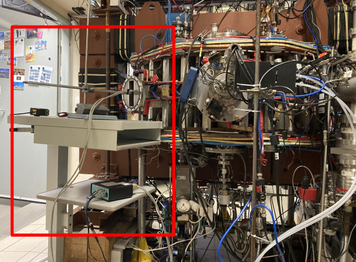
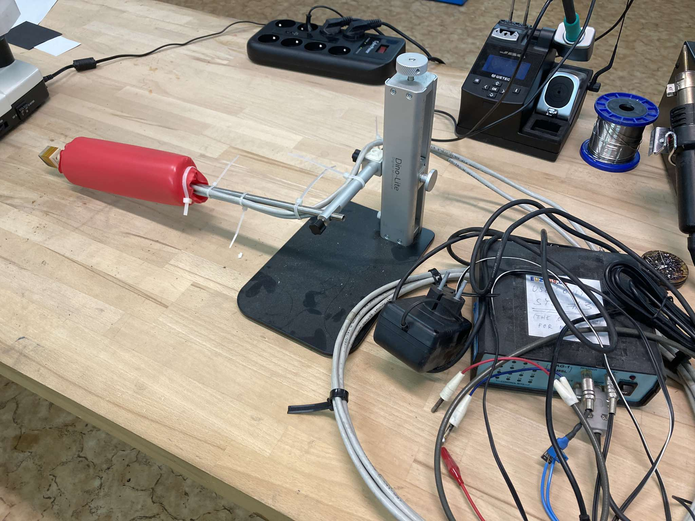

# MSL probe

- consists of 3 Hall sensors and 3 coils (similar to Mirnov coils)  
  Some useful links:
  * [GOLEM wiki page devoted to Hall probe](http://golem.fjfi.cvut.cz/wiki/Diagnostics/Magnetic/HallProbes/diagnostics_hall) (The information might be out of date.)
  * [Measurement of safety factor using Hall probe](http://golem.fjfi.cvut.cz/wiki/Library/CASTOR/KovarikK_Measurements_06.pdf)

  <table>
    <tr>
      <td align="center">
         
        <em>Figure 1: MSL probe</em>
      </td>
      <td align="center">
         
        <em>Figure 2: Orientation</em>
      </td>
    </tr>
  </table>

### Experimental set up of MSL probe

1. Choose port .... (if connected, the icon is green)  
2. Current modes: DC, 10mA, HG: on  
3. Check that the probe is measuring the room temperature correctly  
   - in 24 Bit ADC Mode set T and click on `Data logging`  
4. Trigger  
5. Experimental set up - see Figure 3.

  <table>
    <tr>
      <td align="center">
         
        <em>Figure 3: Experimental set up (first session)</em>
      </td>
      <td align="center">
         
        <em>Figure 4: Software setting</em>
      </td>
    </tr>
  </table>

  <table>
    <tr>
      <td align="center">
         
        <em>Figure 5: MSL probe</em>
      </td>
      <td align="center">
         
        <em>Figure 6: Orientation</em>
      </td>
    </tr>
  </table>

