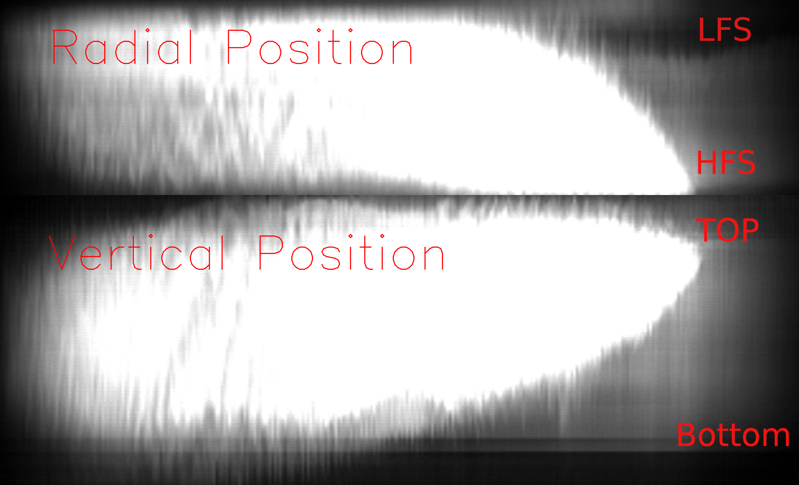
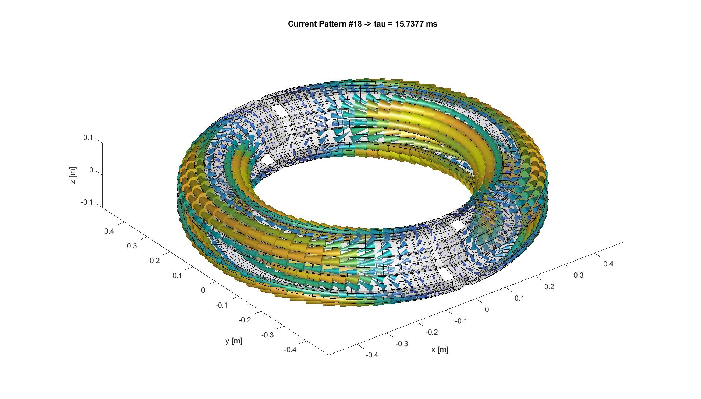
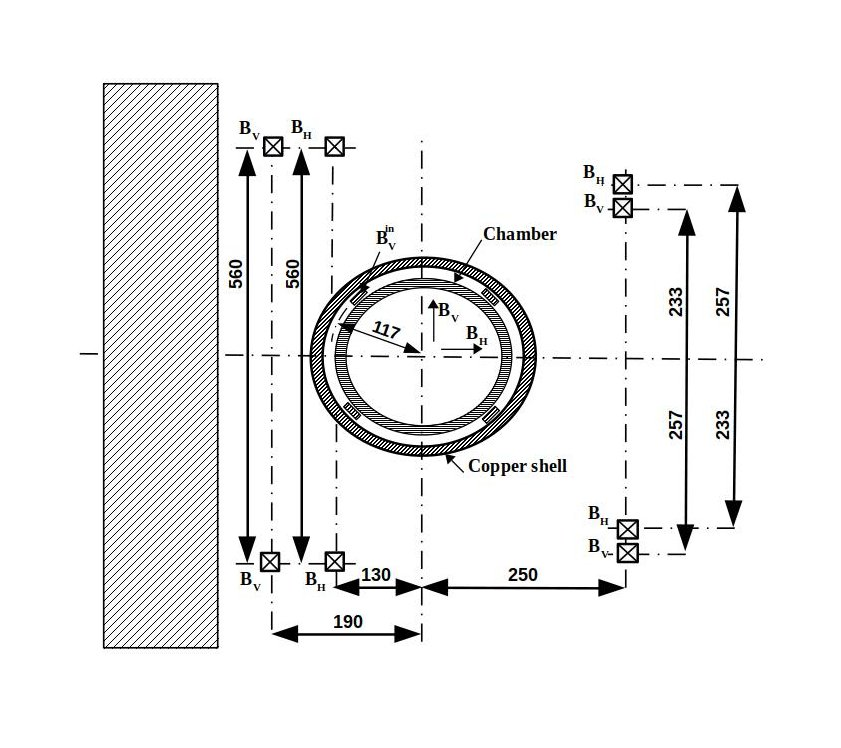

# Investigation of the Feasibility of the Plasma Position Stabilization at tGOLEM
The project aims to investigate the feasibility of plasma position stabilization at Tokamak GOLEM. 

> *Reduce uncertainties from the past. First understand, then construct.*
>  
> *Gather the information on plasma position stabilization in one place.*
> 
> *Uncover the potential limits.*

## Introduction
One of the primary objectives of this project is to analyze the origins of plasma motion. As shown in Figure 1, the characteristic plasma movement in GOLEM is inward in the radial direction and upward in the vertical direction.

   
   
  <em>Figure 1: #39121</em>

The overall process is documented in the [logbook](Logbook.md).

## Problems (motivation) in a Nutshell
* Impact of the copper shell
* Mechanisms behind inward and upward plasma movement
* Magnetic fields and their impact on magnetic diagnostics 
* Discharge quality 
* Technological limits of plasma position stabilization

### Copper shell
The time constant of the copper shell was measured and compared with a model in [A.Kubincova BP](https://dspace.cvut.cz/bitstream/handle/10467/97036/F4-BP-2021-Kubincova-Adela-bp_fttf_21_kubincova.pdf?sequence=-1&isAllowed=y). The time constant was determined to be $\tau = 15.45$ ms.

The modulation of the poloidal magnetic field along the torus, produced by the limbs of the transformer and by the diagnostic windows in the copper shell was investigated in [Valovic: Magnetic_Diagnostics](http://golem.fjfi.cvut.cz/wiki/Library/CASTOR/Valovic_Magnetic_Diagnostics_CZJP_88.pdf) at then-existing CASTOR tokamak (= previous version of tGOLEM). In this report the time constant was considered to be $\tau=1.80$ ms.

   
   
  <em>Eddy currents in the Copper shell. Kindly provided by J. Yanovskiy.</em>

### Discharge performance
The discharge duration is closely tied to its quality/performance, encompassing factors like wall conditioning and instabilities. Additionally, the discharge quality is influenced by the current state of the machine and uncertainties in the technologies used, such as gas puffing. 

Consequently, applying external magnetic fields for plasma position control does not always guarantee the discharge extension. Therefore, before starting the position control, it is required to find the optimal parameters initiating the discharge ($U_{CD}, U_{Bt}, T_{CD}, T_{Bt}, p$). 

Compare very nice shot [\#29457](http://golem.fjfi.cvut.cz/shots/29457/), performed without stabilization, with shot [\#39125](http://golem.fjfi.cvut.cz/shots/39125/) performed with stabilization. (*Pay attention, the discharge duration seems to be identified differently for the old discharges!*) 

From [Valovic: Plasma Position](http://golem.fjfi.cvut.cz/wiki/Library/CASTOR/ValovicM_Plasma_Control_Position_CZJP_89.pdf):
> "It (the current in the external quadrupole coils) starts from a pre-programmed non-zero level which is optimal for breakdown."

Another important note from the paper:
> "The current in the internal quadrupole coils was proportional to the primary transformer current."

### Fields orientation 
- impact of stray fields;
[impact of fields orientation on plasma breakdown](http://golem.fjfi.cvut.cz/wiki/TrainingCourses/Universities/CTU.cz/PRPL/2015-2016/AdamSem/index)

### Technological limits 
>*Is it even achievable with the current version of plasma position stabilization?*

<!-- As mentioned earlier, the discharge duration is influenced by various factors and one important consideration is the possible amount of stored electrical energy used to drive a plasma current, i.e. the capacity $C_{CD}$. (E.g. in the case of the discharge \#39125 the current started decreasing during the discharge - *Do we even have any examples of 'ramp down'?* ) -->

   
   
  <em>Schematic illustration of plasma position stablization coils.</em>

### Origins of Plasma Displacement
- In Adela's BP, the source of the vertical plasma movement (denoted in her thesis as $F_z$) is assumed to be windings of the toroidal magnetic field *Why? Is it possible?*  
- Another force acting on the plasma is the force caused by the copper shell; *Is the force driven by the eddy currents induced in the stainless steel vessel considered? If not, why?*

## Approach

### Data Processing
- [python scripts - magnetic field measurement](python/)
- [matlab scritps - magnetic field calculation](matlab/)

### Diagnostics
diagnostics used with relevant links

**Mirnov Coils**
- [GOLEM wiki page devoted to Mirnov Coils](http://golem.fjfi.cvut.cz/wiki/Diagnostics/Magnetic/MirnovCoilsAtLimiter/Theory/diagnostics_mirnov)

**Fast Cameras**
- [description on GitLab](https://gitlab.com/golem-tokamak/dirigent/-/tree/master/Diagnostics/FastCameras/FastCamSW4WinPC)

**MSL probe:** 
- See section [MSL probe](MSL_probe.md) for more details.

### Reports
- [introductory presentation](presentation/PRPL_uvodni_prezentace.pdf)
- [middle presentation](presentation/PRPLA_introductory_presentation.pdf)
- [report from first session 26.4.2024](experiments/2024_04_26/GOLEM_MSL_24_04_26.pdf)
- [report from second session 16.-17.9.2024](experiments/PRPL_report_Session02.pdf)

### Results Summary
- see [Summary and Outlook](results_summary.md)

