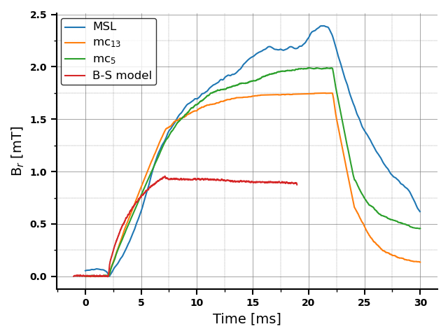
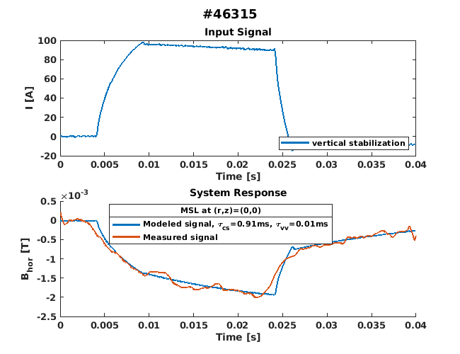
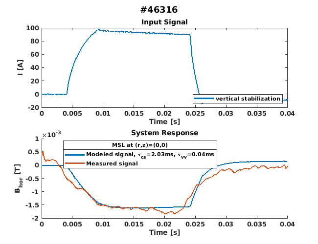
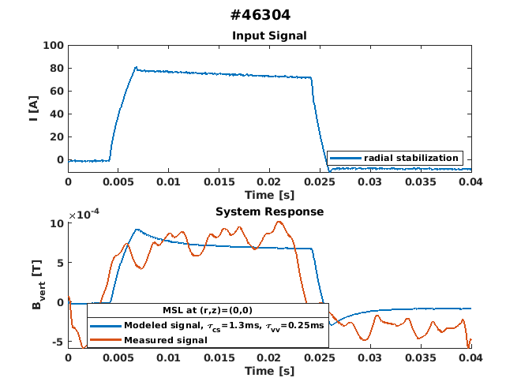
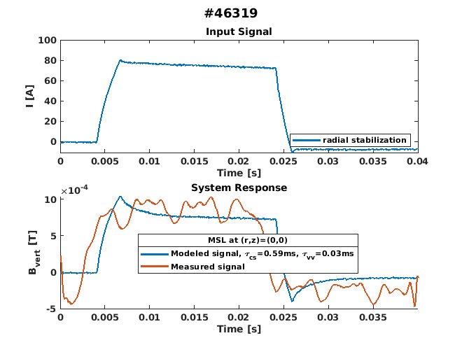

# Summary & Outlook
## Static (naive) B-S Model

   
   
  <em>Figure 1: Coils</em>

  <table>
    <tr>
      <td align="center">
         
        <em>Figure 2: Hor. stab. Bp</em>
      </td>
      <td align="center">
         
        <em>Figure 3: Vert. stab. Bp</em>
      </td>
      <td align="center">
         
        <em>Figure 4: Inner. quadr. Bp</em>
      </td>
    </tr>
  </table>

Comparison with measurements from the first session:

   
   
  <em>Figure 5: Comparison of the radial component of the magnetic field measured by the MSL probe and Mirnov coils, and modeled by a simple Biot-Savart model without considering conducting structures. The data are from shot #44664, where the step-like input waveform was applied to PFC of  the vertical stabilization system. </em>

## Dynamic Model
**First Session**

  <table>
    <tr>
      <td align="center">
         
        <em>Figure 5: </em>
      </td>
      <td align="center">
         
        <em>Figure 6: </em>
      </td>
      <td align="center">
         
        <em>Figure 7: </em>
      </td>
    </tr>
  </table>

- obtained time constants: $\tau_{cs}=1.1$ ms; $\tau_{vv}=0.0011$ ms
- However, the signal was cut off in the middle -> need to get new data

**Second Session**

  <table>
    <tr>
      <td align="center">
         
        <em> </em>
      </td>
      <td align="center">
         
        <em> </em>
      </td>
      <td align="center">
         
        <em> </em>
      </td>
      <td align="center">
         
        <em> </em>
      </td>
    </tr>
  </table>

| Probe Position (r, z) | Shot  | Stabilization | $\tau_{cs}$ | $\tau_{vv}$ |
|-----------------------|-------|----------------|--------------|--------------|
| (0, 0)                | 46315 | Vertical        | 0.91         | 0.01         |
| (0, 0)                | 46304 | Radial          | 1.3          | 0.25         |
| (0.085, 0)            | 46316 | Vertical        | 2.03         | 0.04         |
| (0.085, 0)            | 46319 | Radial          | 0.59         | 0.03         |

The obtained values of time constants rather suggest that the value of $\tau_{cs}$ is closer to that presented in [Valovic: Magnetic_Diagnostics](http://golem.fjfi.cvut.cz/wiki/Library/CASTOR/Valovic_Magnetic_Diagnostics_CZJP_88.pdf) than the one in [A.Kubincova BP](https://dspace.cvut.cz/bitstream/handle/10467/97036/F4-BP-2021-Kubincova-Adela-bp_fttf_21_kubincova.pdf?sequence=-1&isAllowed=y).  

## Magnetic Field Orientation, etc.
Based on the orientation of the MSL probe and the measured signal, the orientation of the fields was determined, as shown in Figure 12. Additionally, a stray field likely generated by the toroidal field winding has been observed. This may be due to inaccurate compensation by the return current conductor (for further details, refer to the [report](experiments/PRPL_report_Session02.pdf)). The signal measured by the MSL probe during no-plasma shots with the inner quadrupole was too low to interpret reliably and is therefore not presented here.

  <table>
    <tr>
      <td align="center">
         
         
        <em>Figure 12: Field Orientation</em>
      </td>
      <td align="center">
         
         
        <em>Figure 13: Sketch of the return current conductor </em>
      </td>
    </tr>
  </table>

