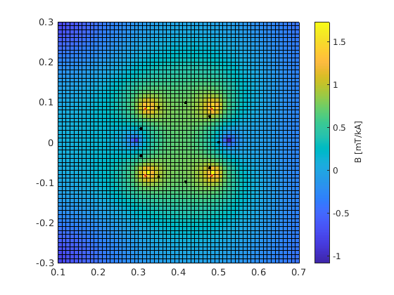

# Summary & Outlook
## Static (naive) B-S Model

   
   
  <em>Figure 1: Coils</em>

  <table>
    <tr>
      <td align="center">
         
        <em>Figure 2: Hor. stab. Bp</em>
      </td>
      <td align="center">
         
        <em>Figure 3: Vert. stab. Bp</em>
      </td>
      <td align="center">
         
        <em>Figure 4: Inner. quadr. Bp</em>
      </td>
    </tr>
  </table>

## Dynamic Model
**First Session**

  <table>
    <tr>
      <td align="center">
         
        <em>Figure 5: </em>
      </td>
      <td align="center">
         
        <em>Figure 6: </em>
      </td>
      <td align="center">
         
        <em>Figure 7: </em>
      </td>
    </tr>
  </table>

- obtained coefficients:

**Second Session**

## Magnetic Field Orientation

   
   
  <em>Figure 1: Field Orientation</em>

   
   
  <em>Figure 2: Return current conductor </em>

